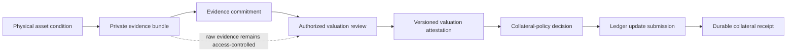

# RWA Collateral Reconciliation

> Experimental working note, version 0.1. This is a narrow reference model, not a valuation product, oracle, lending protocol, or production implementation.

## Purpose

A tokenized financial product can remain internally consistent while the physical condition and accepted valuation of its real-estate collateral change off-chain.

This repository describes one operational boundary: how private condition evidence can be linked to a versioned valuation attestation and how a collateral system can reference that attestation without treating raw evidence, a provisional review, or an unconfirmed update as final financial state.

The focus is reconciliation and provenance around the transition:



The model deliberately does **not** infer a property value from photographs or observations. Valuation remains the responsibility of an authorized professional or institution. The consuming financial system remains responsible for haircuts, margin rules, eligibility, and enforcement.

## Why this boundary matters

Token ownership and transfer logic do not, by themselves, establish that the off-chain asset still supports the value recognized by a financial product. A useful system must preserve the relationship between:

- the legally identified physical asset;
- the evidence snapshot describing its condition;
- the party authorized to issue or accept a valuation;
- the valuation version and its effective period;
- the collateral policy that consumes it; and
- the durable ledger update that records the resulting state.

These records are different evidence types. A captured image is not a valuation, a valuation is not a collateral-policy decision, and a submitted update is not a durable receipt.

## Minimal model

The reference model uses four boundaries:

1. **Evidence capture.** An inspection workflow collects private observations, images, documents, timestamps, and provenance. It produces a bundle identifier and a cryptographic commitment.
2. **Valuation review.** An authorized issuer reviews the evidence and issues a versioned attestation. The attestation may accept, reject, supersede, expire, or revoke a valuation.
3. **Collateral policy.** A separate financial-policy component decides whether and how the accepted valuation affects recognized collateral. Policy is not embedded in the valuation attestation.
4. **Durable update.** The collateral ledger records an update that references the accepted attestation. Until a durable receipt exists, the update remains pending.

See [the state machine](docs/state-machine.md) for normal, retry, dispute, revocation, and stale-valuation paths.

## Core invariants

The model is intended to preserve the following invariants:

1. **Asset identity.** Evidence, valuation, and collateral state refer to the same legal or operational `asset_id` and, when applicable, `unit_id`.
2. **Evidence binding.** Every accepted valuation attestation references an immutable evidence-bundle identifier and commitment.
3. **Typed value.** A valuation identifies amount, currency, valuation basis, valuation time, issuer, lifecycle state, and provenance. A bare number is not a reconcilable value.
4. **Temporal order.** `observed_at` must not be later than `valuation_at`, and `valuation_at` must not be later than `issued_at`. JSON Schema cannot enforce this ordering; the consumer must.
5. **Append-only history.** A new valuation supersedes a previous attestation by reference. It does not overwrite the prior record.
6. **Freshness and revocation.** Expired, rejected, revoked, or superseded attestations cannot authorize a new collateral update.
7. **Finality separation.** A valuation attestation, a policy decision, an update submission, and a durable collateral receipt are distinct states.
8. **Policy separation.** Appraisal value and recognized collateral value are not assumed to be equal. Haircuts and credit policy belong to the consuming financial system.

The optional machine-readable drafts are:

- [`condition-evidence.schema.json`](schemas/condition-evidence.schema.json), binding an asset and capture window to a private evidence commitment;
- [`valuation-attestation.schema.json`](schemas/valuation-attestation.schema.json), binding that commitment to a versioned professional valuation; and
- [`collateral-update.schema.json`](schemas/collateral-update.schema.json), separating the valuation from a financial-policy decision and durable ledger receipt.

## Privacy boundary

Raw photographs, precise addresses, occupant data, reports, and supporting documents should remain off-chain and access-controlled. A shared or public surface should expose only what is necessary for verification, such as a scoped asset identifier, evidence commitment, lifecycle state, issuer reference, expiry, and selectively disclosed valuation facts.

Commitments and pseudonymous identifiers still reveal metadata. Their publication and correlation risks must be assessed for each deployment; hashing data does not automatically make it private.

## Evidence and maturity status

| Component | Status | Claim boundary |
|---|---|---|
| Evidence-bundle integrity foundation | Publicly documented in the author's existing [HREVN](https://hrevn.com/en/evidence-bundles/) work, outside this repository | HREVN documents structured manifests, per-file hashes, a package root hash, and reproducible verification; this repository does not reproduce that implementation. |
| Condition → valuation → collateral model | In development | The public material here is an architectural reference, not an executed end-to-end system. |
| State machine | Draft specification | It distinguishes review, dispute, revocation, submission, receipt, and staleness; it has not been exercised against a production ledger. |
| Three JSON Schemas | Draft specification | They type the three boundaries but do not validate authorization, temporal ordering, signatures, or economic correctness. |
| Synthetic-case validator and tests | Executable reference check | They validate the bundled fixture's structure, selected cross-record relationships, temporal order, declared haircut arithmetic, and file-hash binding. They do not establish authorization, appraisal correctness, signature validity, or external-ledger truth. |
| Smart contracts, valuation method, privacy proofs, live ledger integration | Not implemented | No production behavior or security guarantee is claimed. |

## Synthetic walkthrough

[`examples/synthetic-case/`](examples/synthetic-case/) contains one fictional, non-production walkthrough showing how the three draft envelopes refer to one another. A deliberately narrow validator and four tests make selected relationships executable; they remain a reference check, not an appraisal, cryptographic proof, or live-ledger demonstration.

```bash
python3 -m pip install -r requirements-dev.txt
python3 scripts/validate_synthetic_case.py
python3 -m unittest discover -s tests -v
```

## Related public context

EthSystems' public [Private RWA Tokenization](https://github.com/ethsystems/map/blob/master/use-cases/private-rwa-tokenization.md) use case identifies private pricing and valuation with full history, selective disclosure, attestations, auditability, and issuer solvency as institutional requirements. This independent repository explores one adjacent operational boundary: condition evidence → valuation attestation → collateral state.

No affiliation, endorsement, or commercial relationship is implied.

## License

MIT. See [LICENSE](LICENSE).
