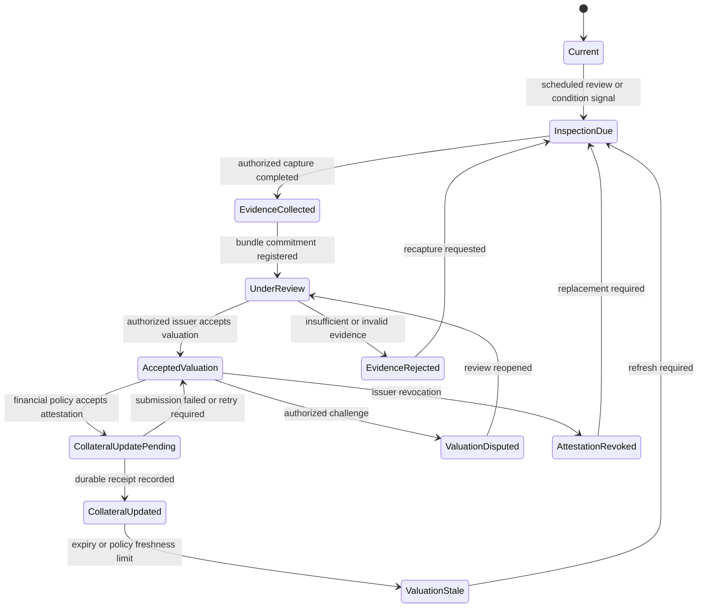

# State Machine

This state machine separates physical evidence, professional valuation, financial policy, and durable ledger state. It is intentionally not a straight-line success path.

## State meanings

| State | Meaning | What it does not establish |
|---|---|---|
| `Current` | The collateral ledger references an accepted valuation considered current under policy. | That the physical condition has remained unchanged. |
| `InspectionDue` | A scheduled review or condition signal requires new evidence. | That impairment exists. |
| `EvidenceCollected` | A private evidence bundle has been closed and committed. | That the evidence is sufficient or that value changed. |
| `UnderReview` | An authorized issuer is evaluating the evidence and valuation basis. | That a valuation has been accepted. |
| `EvidenceRejected` | Evidence was insufficient, inconsistent, or outside the review policy. | That the asset has no value. |
| `AcceptedValuation` | A versioned valuation attestation is accepted and eligible for policy evaluation. | That the financial system must recognize the full appraisal value. |
| `CollateralUpdatePending` | A policy component accepted the attestation and submitted an update. | That the collateral ledger durably recorded it. |
| `CollateralUpdated` | A durable receipt links collateral state to the accepted attestation. | That the valuation remains current indefinitely. |
| `ValuationStale` | The accepted valuation exceeded an expiry or policy freshness limit. | That a replacement valuation has already been issued. |
| `ValuationDisputed` | An authorized actor challenged the evidence, issuer, basis, or result. | That the challenge is valid. |
| `AttestationRevoked` | The issuer revoked the attestation or its authority was invalidated. | That prior downstream actions have automatically been compensated. |

## Transition guards

### Evidence → review

- The bundle is closed and immutable under the capture workflow.
- `asset_id` and optional `unit_id` match the asset under review.
- The bundle exposes a stable identifier and cryptographic commitment.
- Access to raw evidence is authorized separately from access to the commitment.

### Review → accepted valuation

- The issuer is authorized for the asset class and jurisdiction.
- The attestation references the evidence bundle and its commitment.
- Amount, currency, valuation basis, observation time, valuation time, and issue time are explicit.
- A superseding attestation points to the prior version instead of replacing it.

### Accepted valuation → update pending

- Attestation status is `accepted`.
- The attestation is neither expired nor revoked.
- The consuming system evaluates its own collateral eligibility, haircut, and freshness policy.
- Policy output references the exact attestation version it consumed.

### Update pending → updated

- The target ledger returns a durable receipt.
- The receipt references the submitted update and accepted attestation.
- Retry or idempotency logic cannot create two independent updates for the same policy decision.

## Failure and compensation

- Submission failure returns to `AcceptedValuation`; it does not create a second valuation.
- Revocation after `CollateralUpdated` requires an explicit downstream review or compensation process. Revocation alone cannot be assumed to reverse external ledger state.
- A dispute freezes progression under the reference model but does not define legal remedies.
- Staleness is a policy state, not proof of physical deterioration.
